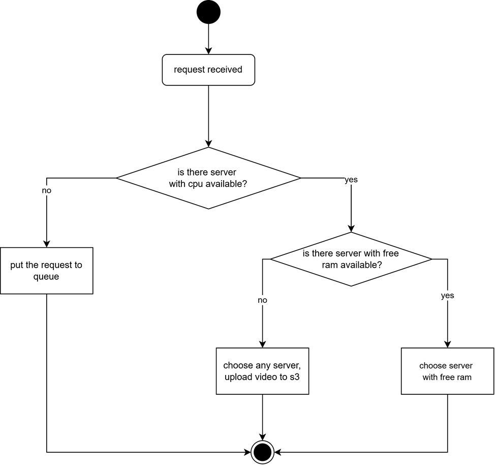
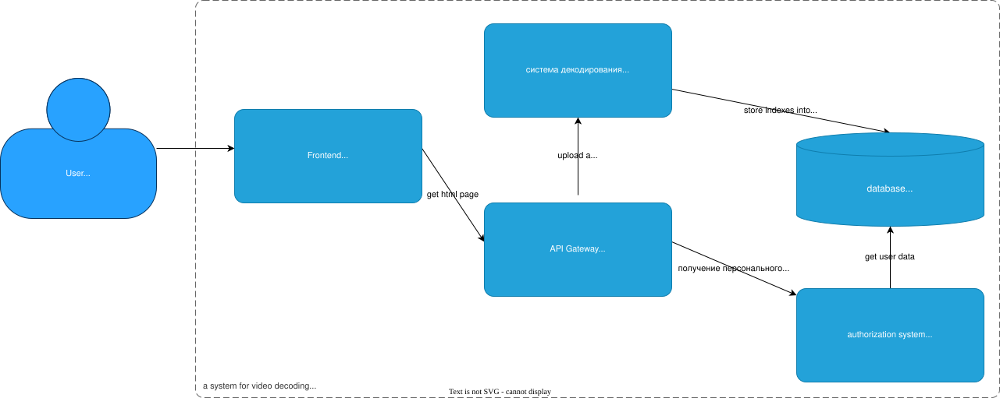

# UFAV1DS
## Ultra Fast AV1 Decoding System


## Что это

Работа состоит из двух частей:
- алгоритмическая низкоуровневая оптимизация видеодекодера AV1 (см. https://github.com/ressiwage/DAV2D)
- архитектурная оптимизация всей системы для бесконечного линейного масштабирования

сравнение быстродействия ведется в сравнении с наивной системой без алго- и архи- оптимизаций.

Цель работы -- реализовать систему, которая декодирует AV1 видео настолько быстро, насколько это возможно, в ущерб качеству но сохраняя достаточное количество информации для индексации видео продуктом TAPe компании Comexp.

## Как это реализовано

Система представляет из себя 5 контейнеров:
- фронтенд
- АПИ шлюз
- система декодирования
- система авторизации
- база данных

**фронтенд** в качестве оптимизации использует FFMPEG, скомпилированный в WASM для отделения аудиодорожки видео от видеодорожки, что сокращает время на загрузку файла

**АПИ шлюз** в качестве оптимизации использует кастомный алгоритм маршрутизации для балансировки нагрузки на сервера, а также вебсокет соединения для уведомлений пользователя



**система декодирования** в качестве оптимизации использует кастомную версию DAV1D, чьи оптимизации описаны [тут](https://github.com/ressiwage/UFAV1VDS/blob/master/docs/md_version/rep.md#%D1%80%D0%B5%D0%B0%D0%BB%D0%B8%D0%B7%D0%B0%D1%86%D0%B8%D1%8F) Также система использует очередь NATS Jetstream для быстрой доставки сообщений

**база данных** в качестве оптимизации использует Redis для кеша и Ceph для данных индексов (не реализовано в работе)



## Установка и запуск

1. создайте .env файл в корне code и code_naive со следующей структурой

```sh
PYTHONUNBUFFERED=1
MYSQL_HOST=db
MYSQL_PORT=3307
MYSQL_USER=appuser
MYSQL_PASSWORD=apppassword
MYSQL_DATABASE=appdb
MYSQL_ROOT_PASSWORD=rootpassword

COMMON_API=http://common-api:8000
QUEUEING_ROUTE=http://queueshit
ACCESS_TOKEN_TTL=3600

GHP_TOKEN="токен ghp для того чтобы заливать образы"
GHP_LOGIN="логин ghp"

GATEWAY_URL=http://localhost:7995
GATEWAY_WS_URL=http://localhost:7995/ws/replica

SERV1_IP="ip первого сервера"
SERV1_LOGIN="логин первого сервера"
SERV1_PASS="пароль первого сервера"

SERV2_IP="ip второго сервера"
SERV2_LOGIN="логин второго сервера"
SERV2_PASS="пароль второго сервера"

S3_BUCKET_NAME="данные для s3"
S3_ACCESS_TOKEN="данные для s3"
S3_SECRET_TOKEN="данные для s3"
```

2. установите на обоих серверах докер и подключите ноды к сворму
3. перейдите в корень code и выполните make deploy
-  если серверов больше чем 2 то сами там настраивайте всё
- возможно где-то я забыл почистить следы от своих серверов. если не запускается -- ищите по   'msk-1-vm-zcps', '194.87.131.81', '7624415-eg826155.twc1.net', '72.56.39.104' и меняйте на свои.
- можно запустить и локально, на одном сервере. для этого выполните make up или docker compose up 

## Ссылки

Полный и финальный текст работы: https://www.hse.ru/edu/vkr/1160980265

[Текст работы в markdown (ru)](https://github.com/ressiwage/UFAV1VDS/blob/master/docs/md_version/rep.md)

[Текст работы в word](docs/stage9_defend/отчёт%20финальный.docx)


[тест1](docs/md_version/rep.md)

[тест2](docs/md_version/rep.md#%D1%80%D0%B5%D0%B0%D0%BB%D0%B8%D0%B7%D0%B0%D1%86%D0%B8%D1%8F)

[тест3](docs/md_version/rep.md#реализация)